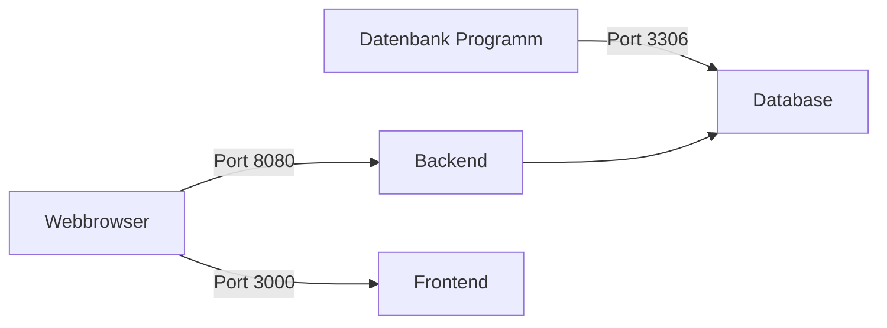
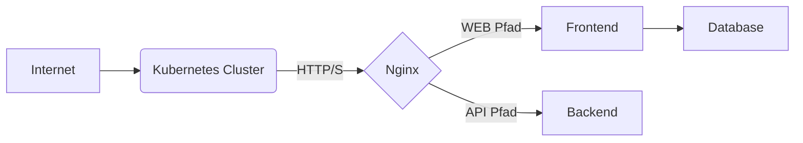

# Level Uphaken Projektübersicht

## Technologien

* Frontend: [nextjs](https://nextjs.org/)
* Backend: SpringBoot
* Datenbank MariaDB
* Proxy: nginx
* Laufzeit: Docker/Kubernetes

## Quick-Start

### Voraussetzungen

Die folgende Software muss lokal installiert sein, Linux benötigt nur Docker.
Docker Desktop sollte WSL2 als Engine nutzen.

* [WSL2](https://docs.microsoft.com/en-us/windows/wsl/install-win10)
* [Docker Desktop](https://www.docker.com/products/docker-desktop)
* [Windows Terminal](https://www.microsoft.com/en-us/p/windows-terminal/9n0dx20hk701) (Optional)

### Setup

**Wichtig:** Bei mir läuft das Projekt *im* WSL2 System deutlich performanter!  
Ich habe es also nach `/home/xyz/...` geklont im WSL2 statt unter `/mnt/c/...`.  

Im WSL2 Terminal muss im geklonten Verzeichnis nur `make start` ausgeführt werden.  
Alle benötigten Container werden heruntergeladen, gebaut und ausgeführt.  

Die einzelnen Komponenten sind wie in der folgenden Grafik zu sehen über lokale Ports erreichbar:

* Frontend [localhost:3000](localhost:3000)
* Backend (API) [localhost:8080](localhost:8080)
* Datenbank [localhost:3306](localhost:3306)

### Übersicht Entwicklungsumgebung

### Kommandos Übersicht

* `make start(-frontend|-backend)` Startet die (jeweilige) Umgebung in Containern zum entwickeln. *Ports siehe oben!*
* `make restart(-frontend|-backend)` Startet die (jeweilige) Container, wenn nötig, neu.
* `make status` Zeigt die aktuell laufenden Container und deren Ports an.
* `make logs(-frontend|-backend)` Zeigt die Log Einträge der (jeweiligen) Container oder aller Container.
* `make shell(-frontend|-backend)` Öffnet eine Shell auf dem jeweiligen Container. *Standart ist Frontend*
* `make stop` Stoppt alle laufende Container.
* `make build` Baut die lokalen Container neu auf. **Impliziert in den start Kommandos!**
* `make destroy` Stoppt alle Container und **löscht** alle relevanten Container Volumes z.B. die Datenbank.
* `make build-backend(--continuous)` Kompiliert das Backend im Container (bei änderungen automatisch) neu.

## Überblick Kubernetes Deployment

Da wir die Anwendung im HAW ICC deployen hier ein kleine Übersicht wie das grob aussehen wird.

